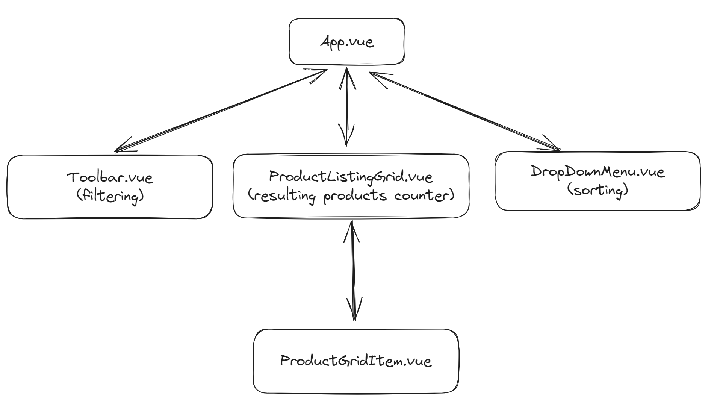
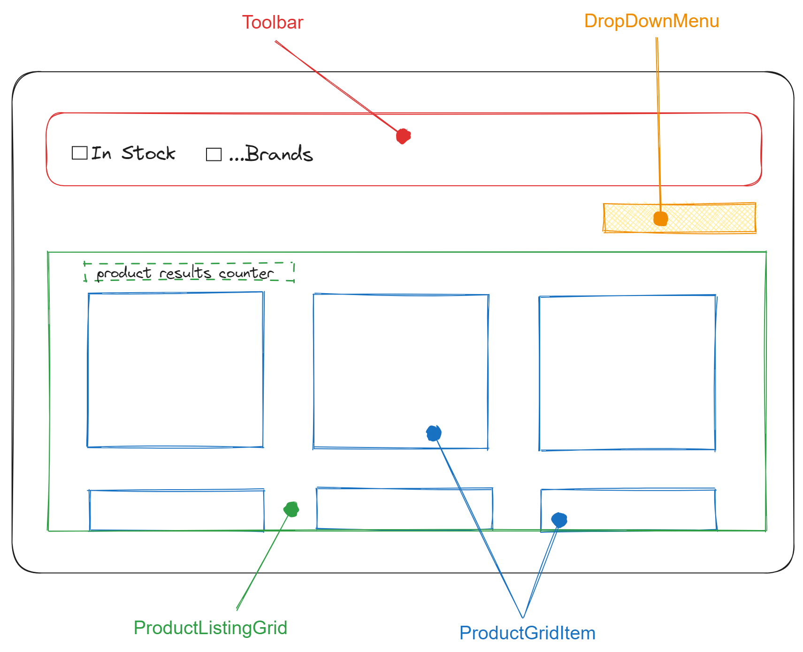

# Product Listing Page with Vue.js

view website [here](https://plp-md.netlify.app/) 😄

This is a simple web application that started as a tech challenge and has since been expanded with additional functionality and styling. The challenge involved implementing basic features, and after its completion, I decided to continue working on it, improving its functionality and appearance. Here's an overview of the changes I made:

- Sorting: I added the sorting feature that allows users to organise the products in three ways:
  1. High to Low: Sorts products in ascending order
  2. Low to High: Sorts products in descending order
  3. Relevance: Sorts products based on availability and ranking

- Styling: I integrated [Tailwindcss](https://tailwindcss.com/docs/installation) for styling

- Bug Fixes: I fixed a bug related to the filtering feature. The filtering functionality now works as expected.

## Initial Planning





## How to run the application

### Prerequisites

Make sure to have node.js and npm installed for managing project dependencies in your local machine.

### Installation

1. Clone the repo

```bash
git clone https://github.com/maddc0de/product-listing-page-vue.git
```

2. install dependencies: navigate to the project directory then run this command

```bash
npm install
```

### Run the Application

```bash
npm run serve
```
